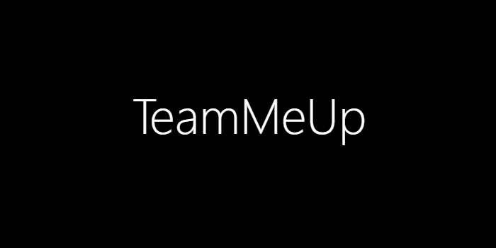
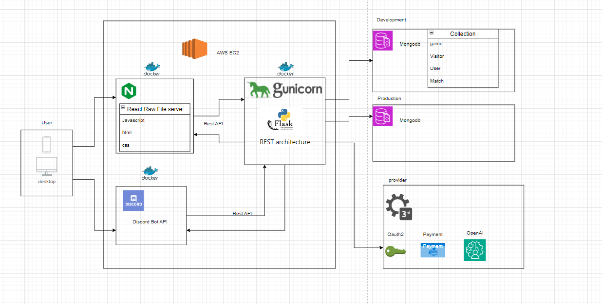

TeamMeUp simplifies the process of finding team mate for your game.

## Introduction

TeamMeUp is a web application with an integrated Discord bot designed to facilitate gamers in finding and joining game matches effortlessly. This platform allows users to seamlessly create or join matches through Discord bot commands or a web interface, promoting an accessible and user-friendly gaming experience.

## Features

- **Matchmaking through Discord**: Utilize the Discord bot to join or create game matches.
- **Web Interface**: Access match-making features through web application.

## Architecture

The system architecture employs AWS EC2 for hosting, Docker for containerization, and a RESTful Flask backend, all working in unison to provide a robust and scalable service. The frontend is built with React, serving raw files to the user's desktop for a smooth in-browser experience.

## Quickstart Guide ( Users )

***Coming soon.***

## Quickstart Guide ( Developer )

### Prerequisites

- Docker
- MongoDB

### Installation

1. Clone the repository:
   `git clone https://github.com/shalayiding/TeamMeUp.git`
2. Navigate to the project directory:
   `cd TeamMeUp`
3. Run the application using Docker:
   `docker-compose up -d`

## Development and Deployment

The project is set up with separate MongoDB configurations for development and production to ensure smooth transitions and data integrity.

## Contributing

We encourage contributions to TeamMeUp. If you have suggestions or issues, please open an issue or submit a pull request.

## Support

For support, please open an issue in the repository, and we will assist you.

Thank you for considering TeamMeUp for your gaming adventures. Happy gaming!
